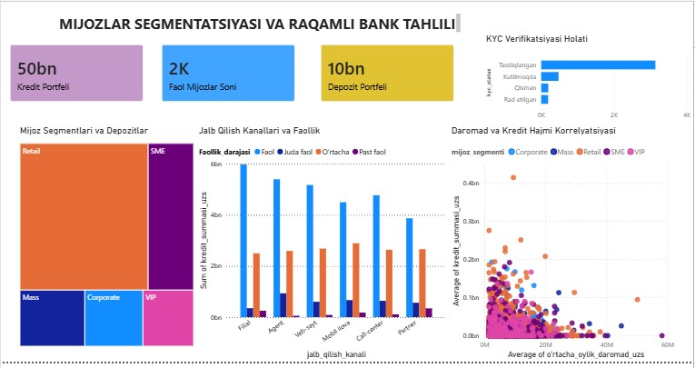
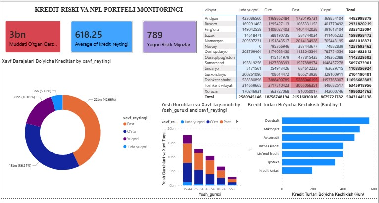

# 🏦 Bank Customer & Credit Risk Analytics Dashboard (Power BI)

## 📌 Project Overview
Ushbu loyiha tijorat bankining mijozlar bazasi, kredit va depozit portfeli, kredit risklari (NPL / Default monitoring) hamda raqamli bank faoliyatini chuqur tahlil qilish uchun ishlab chiqilgan interaktiv **Power BI** tahliliy dashboardlar to'plamidir.

Loyiha ma'lumotlar tahlilchisi (Data Analyst) sifatida ma'lumotlarni tozalash, transformatsiya qilish (Python/Pandas), risk modellarini ishlab chiqish va Power BI yordamida biznes qarorlari qabul qilish darajasidagi vizualizatsiyani yaratish jarayonlarini to'liq qamrab oladi.

---

## 📊 Dashboard Sahifalari va Arxitekturasi

### 1. **Bank Mijozlari va Kredit Portfeli Tahlili (Executive Overview)**
* **Asosiy KPIlar:** Jami mijozlar soni, Depozit portfeli, Muddati o'tgan qarzlar hajmi va Umumiy kredit portfeli.
* **Kredit Turlari Tarkibi:** Ipoteka, mikroqarz, iste'mol, avtokredit va overdraft taqsimoti (Donut Chart).
* **Hududiy Taqsimot:** O'zbekiston viloyatlari kesimida kredit portfeli hajmi (Bar Chart).
* **Sohalar Bo'yicha Tahlil:** Mijozlarning kasb sohalari bo'yicha kreditlar hajmi.
* **Interaktiv Filtrlash:** Xavf reytingi va jalb qilish kanallari bo'yicha dinamik slicerlar.
* 


### 2. **Kredit Riski va NPL Portfeli Monitoringi (Credit Risk & Scoring)**
* **Risk Ko'rsatkichlari:** Muddati o'tgan qarzlar hajmi, O'rtacha kredit skoring balli, Yuqori riskli mijozlar soni.
* **Xavf Darajalari Bo'yicha Portfel:** Past, O'rta, Yuqori va Juda yuqori risk guruhlari segmentatsiyasi.
* **Kredit Turlari Bo'yicha Kechikishlar:** Har bir mahsulot turi bo'yicha o'rtacha to'lov kechikishi kunlari tahlili.
* **Hududlar va Xavf Matritsasi:** Viloyatlar va xavf guruhlari kesimidagi portfel matritsasi (Heatmap).
* **Demografik Risk:** Yosh guruhlari va xavf darajalari korrelyatsiyasi.
* 

### 3. **Mijozlar Segmentatsiyasi va Raqamli Bank Tahlili (Customer Analytics & FinTech)**
* **Mijozlar Segmentatsiyasi:** Retail, SME, Mass, Corporate va VIP toifalar bo'yicha depozit taqsimoti (Treemap).
* **Jalb Qilish Kanallari:** Filial, Mobil ilova, Veb-sayt, Agent, Call-center kanallarining samaradorligi va mijozlar faolligi.
* **Daromad va Kredit Hajmi Korrelyatsiyasi:** Oylik daromad va olingan kredit miqdori o'rtasidagi bog'liqlik (Scatter Plot).
* **KYC Verifikatsiyasi:** Mijozlarning identifikatsiya statuslari (Tasdiqlangan, Kutilmoqda, Rad etilgan).
* 

---

## 🛠 Ishlatilgan Texnologiyalar va Vositalar
* **Power BI Desktop:** Interaktiv vizualizatsiyalar, DAX o'lchovlari (Measures), ma'lumotlar modeli.
* **Python (Pandas, NumPy):** Dastlabki ma'lumotlarni tozalash, kovertatsiya qilish, hisoblangan ustunlarni shakllantirish.
* **DAX (Data Analysis Expressions):** Agregatsiya, shartli hisob-kitoblar va KPI o'lchovlari.
* **Data Modeling:** Star / Snowflake schema asosida toza ma'lumotlar strukturasi.

---

## 📈 Biznes Uchun Asosiy Xulosalar (Key Business Insights)
1. **Raqamli Kanallarning O'sishi:** Mobil ilova va veb-sayt orqali jalb qilingan mijozlar soni oshib bormoqda, ammo eng yirik depozit va kredit hajmlari hamon an'anaviy filiallar hissasiga to'g'ri keladi.
2. **Kredit Riski Konsentratsiyasi:** Overdraft va mikroqarzlar bo'yicha to'lov kechikish kunlari eng yuqori ekani aniqlandi. Ushbu mahsulotlar uchun skoring talablarini kuchaytirish tavsiya etiladi.
3. **Mijozlar Segmentatsiyasi:** Retail va SME segmentlari bank depozit va kredit portfelining asosiy drayverlari hisoblanadi.

---

## 📂 Loyiha Strukturasi
```text
├── data/
│   └── bank_data_powerbi_ready.csv    # Qayta ishlangan va tozalangan ma'lumotlar
├── dashboards/
│   └── Bank_Portfolio_Analytics.pbix  # Power BI hisobot fayli
├── screenshots/
│   ├── page1_overview.png             # 1-sahifa skrinshoti
│   ├── page2_risk_npl.png             # 2-sahifa skrinshoti
│   └── page3_customer_fintech.png     # 3-sahifa skrinshoti
└── README.md                          # Loyiha hujjatlashuvi
```

---

## 👤 Muallif
* **Abbosjon**
* *Data Analyst / Financial Analytics*
